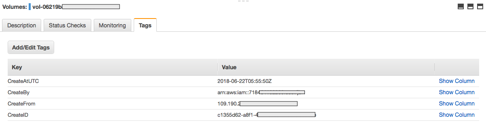

AWS Tagging Machine
===================

Auto applying tags for AWS resources for a better activity and costs tracking.

Description
-----------

This project use a Lambda function to tag AWS resources by following this
process:
1. CloudTrail produces events
2. These events are catch by an CloudWatch Event Rule
3. The Rule trigger an Lambda function
4. The function tags the resource depending on event source

Here is an example of applied tags on a resource:

Current event supported:
- (EC2) RunInstances
- (EC2) CreateRouteTable
- (EC2) CreateSnapshot
- (EC2) CreateSubnet
- (EC2) CreateVolume
- (EC2) CreateInternetGateway
- (DynamoDB) CreateTable

Much more events will be added, see TODO section for more information.
Work in progress.

Prerequisites
-------------

Obviously, **CloudTrail must be activated.**

Deployment
----------

Deployment with CloudFormation
^^^^^^^^^^^^^^^^^^^^^^^^^^^^^^

To deploy this solution you can use the CloudFormation template present in the
"deployment" directory. This directory also contains a ZIP file containing the
whole source code of this project.

Before create a new CloudFormation stack with that template, you have to:
1. Upload the zip file to a S3 bucket
2. Edit the CloudFormation template and replace the bucket name in line 37 with
   your bucket's name
3. Then, create a new CloudFormation Stack with the template

TODO
----

The development is still ongoing. The next releases will add:
- support of more events and AWS services
- other deployment methods (Ansible and Terraform probably)
- another stuff, who knows :-)

Pull requests are welcome.

License
-------

This project is under GPL3 license.